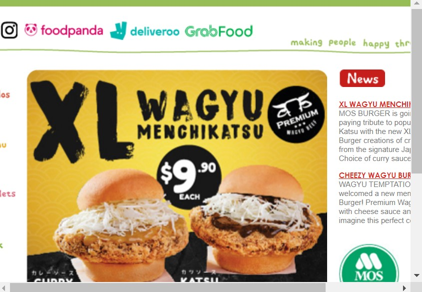

# Revamp project

## Table of contents

* Introduction
* Built with
* Illustrations
* Getting Started
* Authors and acknowledgement

## Introduction

This is my individual project for the Trent Global Software Development Basic course. I have used the current version of the Mos Burger website and updated it. 

## Built with

* HTML
* CSS
* Visual Studios Code
* GitHub

## Illustrations

## Getting Started

###Starting point

Mos Burger website: 

The current website for Mos Burger Singapore can be improved upon! On the top of the website, there are many social media icons that clutter the brand logo and brand motto.  On a smaller screen, the brand logo is hidden! The navigation bar is barely accessible. With some adjustment to HTML and CSS, the website becomes cleaner and responsive to the user.

### Usage

1.	Positioning – used on various elements across website
2.	Flexbox – used on navigation bar and main content
3.	Demonstrate the website is responsive in adjusting to the sizing of a phone, ipad and laptop – media query provided for typical breakpoints
4.	Website ability to load one background image – background image of burger
5.	Website ability to load an image directly into HTML – used images uploaded and used images URL
6.	Padding and Margin should be used when necessary – used on various elements across website
7.	Row and columns should be used when necessary – row used for navigation bar and main content, columns used for navigation bar links

## Authors and acknowledgement

* Trent Global
